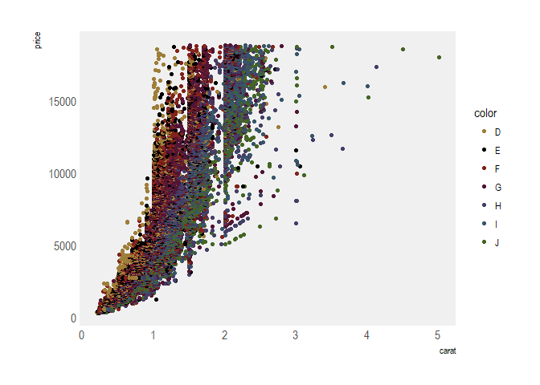
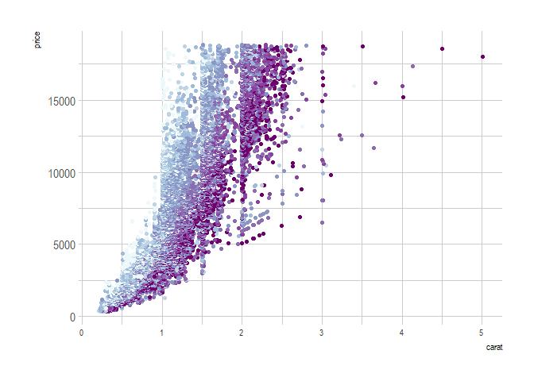
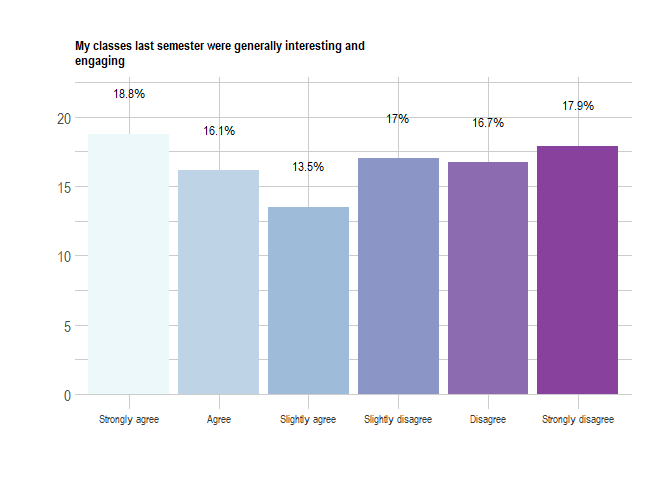
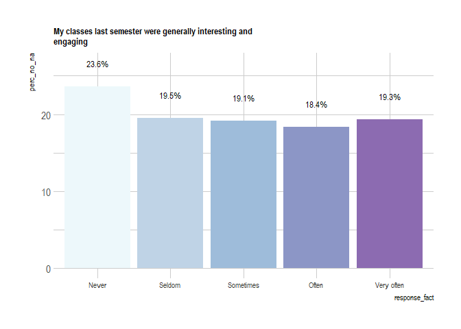

<!-- README.md is generated from README.Rmd. Please edit that file -->
datademon
=========

This is a package that has some common functions and styles that are useful for Wake Forest University. This includes:

Stylistic Points
----------------

-   Color Pallettes
-   Font Selections
-   Chart Formatting

USeful Functions
----------------

These have been gathered over my experience and can be useful \* Exploratory Data Analysis Tools \* Common Functions I use \* Data cleaning Tools

Installation
------------

You can install datademon from GitHub with:

``` r
# install.packages("devtools")
devtools::install_github("medewitt/datademon")
```

Guide
-----

### Application of the Wake Style Guide

``` r
library(datademon)
library(ggplot2)
library(extrafont)
#> Registering fonts with R
library(rlang)
suppressPackageStartupMessages(library(tidyverse))

ggplot(diamonds, aes(carat, price, group = color, color = color))+
  geom_point()+
  scale_colour_wake()+
  theme_wake()
```



### Application of the Wellbeing Survey Template

``` r
library(extrafont)
ggplot(diamonds, aes(carat, price, group = color, color = color))+
  geom_point()+
  scale_colour_wellness()+
  theme_wellbeing()
```



### Application of Likert Six Scale

``` r
datademon::update_geom_font_defaults()
make_wellbeing_charts(data = survey_sample, "ACAENG_ACAENG_1", likert_scale = "agreement")+ylab("")+xlab("")
```



``` r
make_wellbeing_charts(data = survey_sample, "ACTIVITIES_1_9", likert_scale = "frequency")
```



### Application of

Thanks
------

Not all of these tools originated from me. Many have been stolen with pride and modified. Special thanks to Bob Rudis for his work with the hrbrthemes package which helped me create all of my themes. Additional thanks to Karl Broman for some of his tools. And of course to RStudio for making the tools easier and easier to use.
